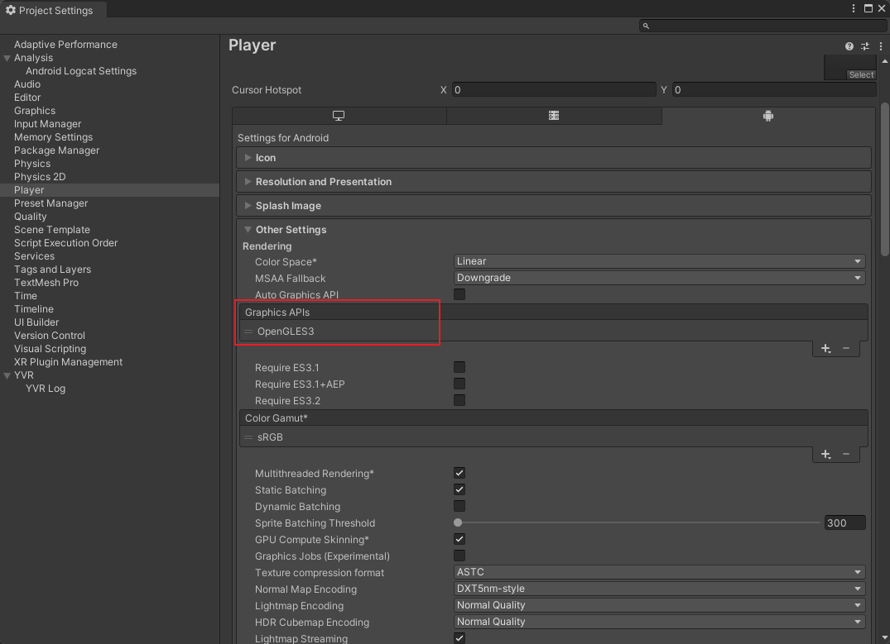
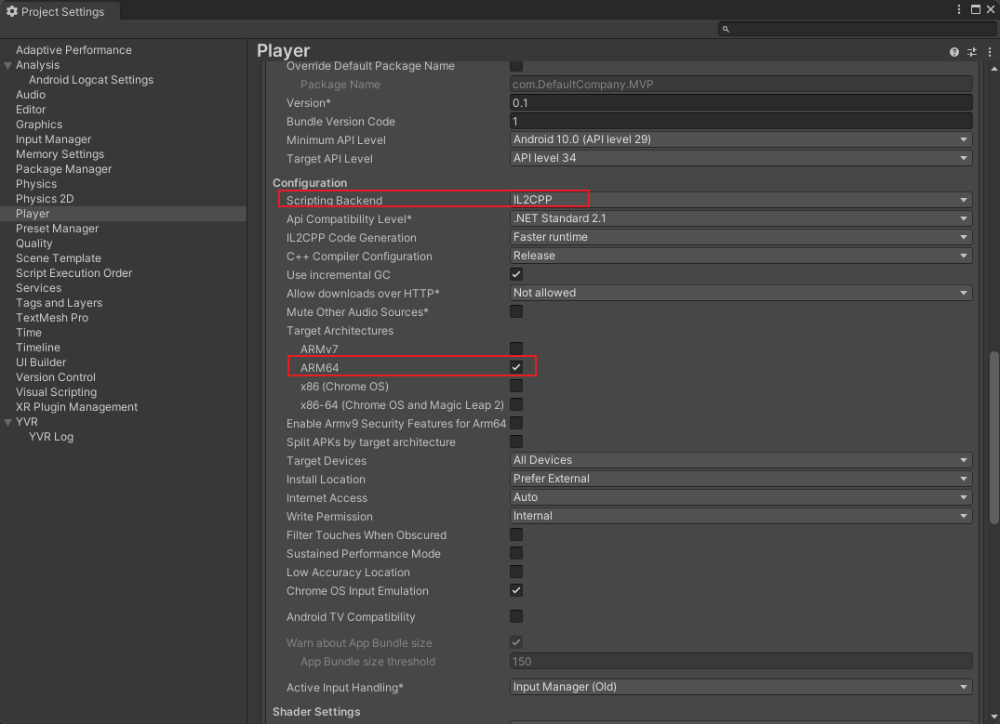
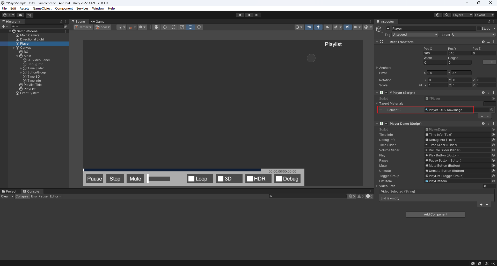
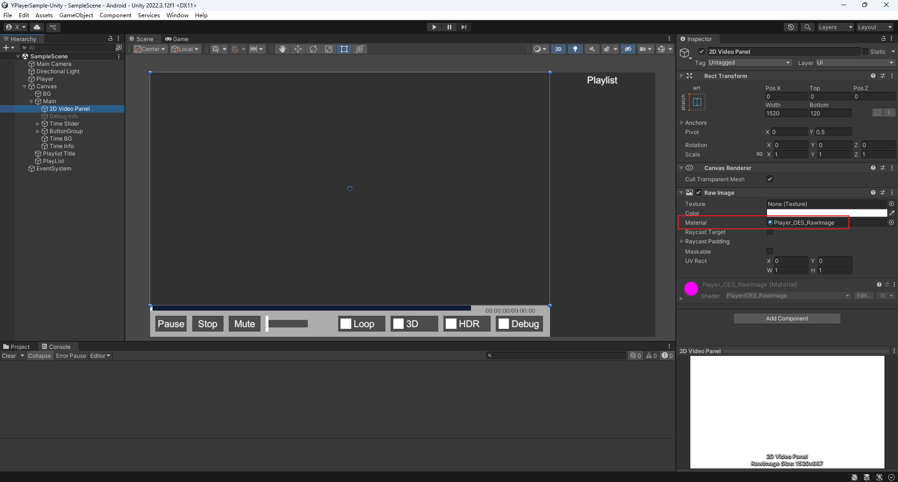

[中文文档](./README_ZH.MD)

# YVR Player Unity Sample Project

This sample project demonstrates how to integrate and use the YVR Player in a Unity environment (built with Unity 2022.3.12f1). Below are the key dependencies and setup instructions.

## Dependencies

In addition to Unity's built-in libraries, this project relies on the following packages:

| Package Name             | Version  | Description                                                                 |
|--------------------------|----------|-----------------------------------------------------------------------------|
| **YVR Player**           | 1.3.2    | A video playback library based on ExoPlayer, offering broader format support and better decoding performance compared to Unity's VideoPlayer. |
| **YVR AndroidDeviceCore**| 1.2.0    | Simplifies and secures interactions between Unity C# scripts and Android Java classes via AndroidJavaClass/JNI. |
| **YVR UniRx**            | 0.2.1    | Extends functionality of the UniRx library.                                 |
| **YVR Utilities**        | 0.15.10  | A utility library for common Unity operations, including rendering thread management and C# data structure optimizations. |

---

## How to Integrate YVR Player into Your Project

### 1. Add YVR Packages  
Reference the following entries in your project's `packages.json` to include YVR dependencies:

```json
{
  "dependencies": {
    ...
    "com.yvr.android-device.core": "git@github.com:PlayForDreamDevelopers/com.yvr.android-device.core-mirror.git?path=/com.yvr.android-device.core#0540b2af10a4d83e40f3b62b457a5bb6e742e9b6",
    "com.yvr.json-parser": "git@github.com:PlayForDreamDevelopers/com.yvr.json-parser-mirror.git?path=/com.yvr.json-parser#87438d1a077e9b648dc5393637174f33aaefe104",
    "com.yvr.player": "git@github.com:PlayForDreamDevelopers/com.yvr.player-mirror.git?path=/com.yvr.player#051858c079647678aea66a910e7150a54a1179b9",
    "com.yvr.unirx": "git@github.com:PlayForDreamDevelopers/com.yvr.unirx-mirror.git?path=/com.yvr.unirx#a795fe53c94d3761f6bad216c05bb480b926bc8f",
    "com.yvr.utilities": "git@github.com:PlayForDreamDevelopers/com.yvr.utilities-mirror.git?path=/com.yvr.utilities#c06beb422cd7e07324aa50ec3196be2ef1de1205",
    ...
  }
}
```

### 2. Open Project Settings  
Navigate to **Edit > Project Settings...** and select the **Player** tab.

### 3. Configure Player Settings  
Ensure the following settings under **Other Settings**:

#### Graphics APIs  
• **Configured to OpenGLES3 only.**  
    

#### Android API Levels  
• **Minimum API Level**: Android 10.0 (API Level 29)  
• **Target API Level**: 34 (Android 14)  
    

#### Scripting and Architecture  
• **Scripting Backend**: IL2CPP  
• **Target Architectures**: ARM64 only  
    

### 4. Set Up the YPlayer Component  
1. In your scene, attach the **YPlayer** component to a GameObject (reference the `SampleScene` example).  
2. Configure the **TargetMaterials** property to use the same material assigned to the RawImage component responsible for rendering video.  

     
     

---

For troubleshooting or advanced configurations, refer to the official YVR documentation or contact the development team.
