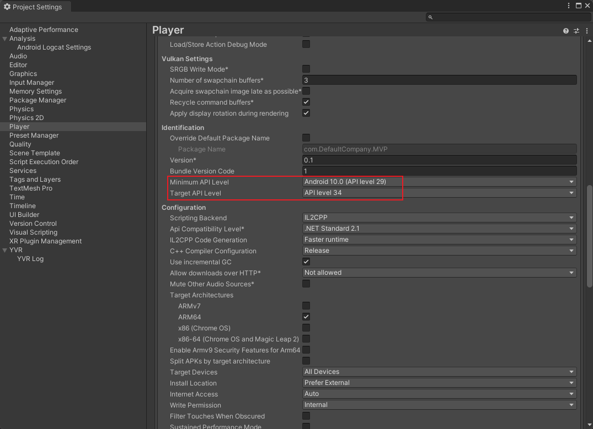

[](./README.zh.md)

This sample project demonstrates how to use YVR Player in Unity environment, built on Unity 2022.3.52f1. Besides internal Unity libraries, it mainly depends on:

1. [YVR Player](https://github.com/PlayForDreamDevelopers/com.yvr.player-mirror)
2. [YVR AndroidDeviceCore](https://github.com/PlayForDreamDevelopers/com.yvr.android-device.core-mirror)
3. [YVR UniRx](https://github.com/PlayForDreamDevelopers/com.yvr.unirx-mirror)
4. [YVR Utilities](https://github.com/PlayForDreamDevelopers/com.yvr.utilities-mirror)
5. [YVR Core](https://github.com/PlayForDreamDevelopers/com.yvr.core-mirror)

> [!important]
>
> This example USES [YVR Core](https://github.com/PlayForDreamDevelopers/com.yvr.core-mirror) is 1.23.10 version, This version is only available under OS 3.1.0.55 or later. For older system versions, You can choose to use the YVR developer platform`s website [YVR Core v2.8.0](https://developer.pfdm.cn/yvrdoc/unity_CN/UserManual_CN/ReleaseNotes/ReleaseNotes2.8.0.html).

The sample provides implementations for online/offline video playback controls, and demonstrates applications of:
• 3D parallax video with side-by-side/top-and-bottom layouts
• 180°/360° panoramic videos

To add local test videos, you can put them in the "\Android\data\com.yvr.playerdemo\files\videos" directory

A list of recommended online videos: https://gist.github.com/jsturgis/3b19447b304616f18657

## How to Integrate YVR Player into Other Projects?

1. Reference the `packages.json` in the project to add YVR-related packages:

   ```json
   {
     "dependencies": {
   ...
       "com.yvr.android-device.core": "git@github.com:PlayForDreamDevelopers/com.yvr.android-device.core-mirror.git?path=/com.yvr.android-device.core#0540b2af10a4d83e40f3b62b457a5bb6e742e9b6",
       "com.yvr.core": "git@github.com:PlayForDreamDevelopers/com.yvr.core-mirror.git?path=/com.yvr.core#212cf5ea67829799bcd8b9f7f7963b2dfd0b0505",
       "com.yvr.json-parser": "git@github.com:PlayForDreamDevelopers/com.yvr.json-parser-mirror.git?path=/com.yvr.json-parser#87438d1a077e9b648dc5393637174f33aaefe104",
       "com.yvr.player": "git@github.com:PlayForDreamDevelopers/com.yvr.player-mirror.git?path=/com.yvr.player#051858c079647678aea66a910e7150a54a1179b9",
       "com.yvr.unirx": "git@github.com:PlayForDreamDevelopers/com.yvr.unirx-mirror.git?path=/com.yvr.unirx#a795fe53c94d3761f6bad216c05bb480b926bc8f",
       "com.yvr.utilities": "git@github.com:PlayForDreamDevelopers/com.yvr.utilities-mirror.git?path=/com.yvr.utilities#c06beb422cd7e07324aa50ec3196be2ef1de1205",
   ...
     }
   }
   ```

2. Open Project Settings via menu "Edit/Project Settings..." and navigate to the Player tab.

3. Ensure the following configurations in Other Settings:
   
   1. Verify project setup according to [Get Started (XR)](https://developer.pfdm.cn/yvrdoc/unity/UserManual/GetStartedXR.html)
   
   2. Set Minimum API Level to Android 10.0 and Target API Level to 34 (required by ExoPlayer)
   
   
   
   3. Reference the Player GameObject in SampleScene: Attach YPlayer component and configure its output materials. Ensure the materials in TargetMaterials match those used in the RawImage component for video rendering.
